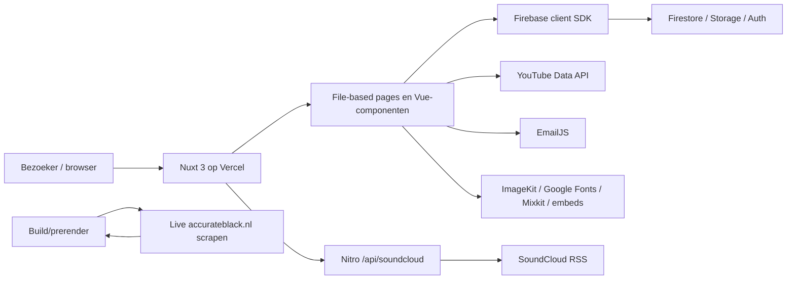

# Accurate Black — codebase-audit en moderniseringsplan

Auditdatum: 6 augustus 2026  
Repository: `Pfrommer1982/accurate-black` (lokale map `FB-ACB`)  
Scope: technische, functionele, security-, dependency-, performance-, SEO-, WCAG-, UX-, visuele en CI/CD-audit.  
Wijzigingsstatus: alleen dit rapport is toegevoegd; applicatiecode, dependencies, configuratie en publieke functionaliteit zijn niet gewijzigd.

## Onderzoeksmethode en bewijskracht

De bevindingen zijn gebaseerd op:

- inspectie van alle 77 getrackte bestanden en circa 6.996 regels Vue/JS/TS/SCSS;
- `pnpm audit --json`, `pnpm outdated --format json`, de npm-registry en de werkelijk opgeloste lockfile;
- productiebuild met Node 26.5.0 en pnpm 10.15.0;
- live controles van alle publieke routes en authgrenzen op `https://www.accurateblack.nl`;
- live responseheaders, robots.txt, sitemap, statussen en soft-404's;
- axe-core 4.12.1 op WCAG 2.2 AA en een Lighthouse-labmeting op mobiel;
- Git-status en Git-history op bekende secretpatronen.

“Bevestigd” betekent rechtstreeks bewezen in code, buildoutput of live productie. “Aanname/te verifiëren” betekent dat cloudinstellingen of data buiten de repository nodig zijn. Er is geen geauthenticeerde GitHub-, Firebase- of Vercel-console-audit uitgevoerd. Secrets en waarden uit `.env` zijn niet weergegeven.

## A. Executive summary

1. De site draait op Nuxt 3.21.1, Vue 3.5.29, Nitro 2.13.1 en Vite 7.3.1; de stack is bruikbaar en hoeft niet te worden vervangen.
2. Advies: geen volledige greenfield-rebuild. Kies een gecontroleerde modernisering met herbouw van de security-/contentgrens en gerichte frontendcomponenten.
3. `pnpm audit` meldt 6 kritieke, 45 hoge, 48 middelhoge en 7 lage advisories in 1.219 dependency-nodes. Niet alle zijn productie-exploiteerbaar, maar de lockfile is geen acceptabele releasebasis.
4. Nuxt 3.21.1 valt onder meerdere recente advisories; de veilige eerste dependency-ingreep is Nuxt 3.21.10 binnen major 3, niet direct Nuxt 4.
5. Bevestigd hoog risico: beheerders slaan volledige iframe-HTML op die op publieke pagina’s via `v-html` wordt uitgevoerd. Dit is een stored-XSS-keten.
6. Bevestigd hoog risico: iedere Firebase-gebruiker met geldige authenticatie mag alle contentcollecties schrijven en alle storagepaden uploaden; er is geen adminrol.
7. Bevestigd hoog risico: `/admin/table` is live zonder login bereikbaar. De twee andere adminroutes redirecten wel naar login.
8. Uploads hebben geen limiet op bestandstype, grootte, afmetingen of padbeleid. Dat verhoogt malware-, kosten- en misbruikrisico.
9. De publieke pagina Accurate Sessions verwijdert bij een ingelogde beheerder automatisch oude database-items tijdens een leesactie. Presentatie en destructief onderhoud zijn ten onrechte gekoppeld.
10. Securityheaders ontbreken grotendeels. HSTS is aanwezig, maar CSP, framebescherming, Referrer-Policy, Permissions-Policy en nosniff ontbreken.
11. Cookieconsent is niet AVG-conform: alleen accepteren is mogelijk, externe embeds/API’s laden al vóór toestemming en intrekken/keuzes ontbreken.
12. Alle pagina’s behalve de homepage canoniseren live naar de homepage. Dit is een ernstig indexeringssignaal voor duplicate content.
13. De live robots.txt blokkeert admin niet, de statische sitemap bevat login maar geen releases/artiestdetails, en onbestaande detailroutes retourneren 200 (soft 404).
14. De globale OG-/schema-afbeelding en twee lokale fallbackassets retourneren 404 door foutieve `/public/img/...`- en ontbrekende `/img/...`-paden.
15. Belangrijke content wordt pas na client-side Firebase-requests geladen. De build prerenderde geen release- of artiestdetailroutes; dit schaadt SEO, GEO en first render.
16. De productiebuild slaagt, maar bevat een clientchunk van 750,8 kB (245,8 kB gzip) en 100,8 kB globale CSS. Lighthouse mat 5,3 MiB, 119 requests en 13,8 s LCP.
17. Firebase wordt op de homepage dubbel opgevraagd; globale SCSS wordt in ieder scoped component geïnjecteerd; ongebruikte modules trekken veel code en advisories mee.
18. Er zijn geen lint-, format-, typecheck-, unit-, component-, E2E-, accessibility-, visual-regression- of CI-checks. Typecheck faalt door ontbrekende root-tsconfig.
19. De visuele identiteit is herkenbaar en passend voor een dark-techno-label, maar langdurige preloaders/fades, klein mobiel type, herhaling en generieke stockvideo maken het resultaat minder premium en toegankelijk.
20. Veiligste volgorde: back-up/nulmeting → auth/XSS/rules/headers → Nuxt 3-patch en transitieve securityfixes → ongebruikte packages → SSR/contentarchitectuur → UX/redesign → Nuxt 4.

## B. Scores

| Onderdeel | Score | Onderbouwing |
|---|---:|---|
| Security | 3/10 | Stored-XSS-keten, publiek adminscherm, te brede Firebase-regels, onbeperkte uploads, 106 advisories en ontbrekende headers. |
| Onderhoudbaarheid | 4/10 | Kleine codebase, maar grote SFC’s, Options/Composition-mix, duplicatie, client-datafetching en geen kwaliteitsrails. |
| Performance | 5/10 | Build slaagt en CLS/TBT zijn redelijk; Lighthouse performance 67, LCP 13,8 s, 5,3 MiB en één chunk van 750,8 kB. |
| SEO | 4/10 | Titels en descriptions bestaan, maar verkeerde canonicals, incomplete sitemap, soft 404’s, 404 social image en client-only detailcontent. |
| Toegankelijkheid | 5/10 | Lighthouse 95 maskeert handmatige problemen: keyboardcontrols, focus, motion, landmarks, labels, modalgedrag en headingstructuur. |
| UX | 5/10 | Duidelijke muzikale sfeer en navigatie, maar introvertraging, gesloten kernflow, lange pagina’s en zwakke error/empty states. |
| Conversie | 3/10 | Luister-CTA’s zijn zichtbaar; demo-inzending is gesloten en contact/licensing/booking/newsletter/trustflows zijn zwak. |
| Visueel ontwerp | 6/10 | Sterke monochrome merktaal en fotografie, maar gedateerde motion, compacte typografie, inconsistent ritme en stockvideo. |
| Codekwaliteit | 4/10 | Buildbaar, maar live JS-fout, legacyconfig, ongedefinieerde variabelen, dode code, weinig types en destructieve side effects. |
| Toekomstbestendigheid | 4/10 | Nuxt/Vue zijn toekomstvast; huidige runtime-, content-, auth-, dependency- en CI-inrichting niet. |

De Lighthouse SEO-score op alleen de homepage was 100. Dat verandert de codebase-score niet: Lighthouse detecteert geen sitebrede canonical-, sitemap-, soft-404- en dynamische-renderingproblemen.

## Huidige projectinventarisatie

### Stack, runtime en package manager

| Onderdeel | Bevestigde staat |
|---|---|
| Framework | Nuxt 3.21.1 uit de lockfile; manifest declareert `^3.16.2` (`package.json:24`). |
| UI-runtime | Vue 3.5.29; Vite 7.3.1; Nitro 2.13.1. |
| Node | Geïnstalleerde Nuxt vereist `^20.19.0 || >=22.12.0`. De repository heeft geen `engines`, `packageManager`, `.nvmrc` of `.node-version`. |
| Conflict | `firebase.json:9-12` noemt Node 18, terwijl de huidige Nuxtversie minimaal Node 20.19/22.12 vraagt. Dit Firebasepad lijkt stale. |
| Package manager | pnpm, bewezen door `pnpm-lock.yaml` en lokale pnpm 10.15.0. |
| TypeScript | Alleen `server/api/soundcloud.ts`, `usePageSeo.ts` en enkele `lang="ts"`-pagina’s; geen root `tsconfig.json`. |

Aanbevolen pin voor de huidige fase: Node 22.12+ (liefst de ondersteunde 22 LTS-patch binnen de hostingomgeving) en pnpm 10 via `packageManager`. Kies bij Nuxt 4 later een expliciet ondersteunde Node 24 LTS-patch en verifieer Vercel-support vóór omzetting.

### Commando’s en kwaliteitsniveau

| Doel | Bestaand commando | Auditresultaat |
|---|---|---|
| Development | `pnpm dev` | Aanwezig. |
| Build | `pnpm build` | Slaagt; warnings voor dubbele Icon-component, oude Browserslistdata, ontbrekend asset, >500 kB chunk en sharp-binary. |
| Static generate | `pnpm generate` | Aanwezig, niet als primaire deployconfig gebruikt. |
| Preview | `pnpm preview` | Aanwezig. |
| Postinstall | `nuxt prepare` | Aanwezig. |
| Lint/format | Geen | ESLint is niet geïnstalleerd. |
| Typecheck | Geen script | `nuxi typecheck` faalt: geen root `tsconfig.json`. |
| Tests | Geen | `pnpm test` bestaat niet. |
| Deploy | Geen script | Nitro preset en live headers bewijzen Vercel; vermoedelijk Git-integratie, maar die is niet lokaal aantoonbaar. |

### Routes, componenten, styling en content

- File-based routing onder `pages/`: homepage, releases, artiesten, shows, demo, about, privacy, login en drie adminpagina’s.
- Dynamische routes: `pages/releases/[id].vue` en `pages/artists/[artist].vue`.
- Globale shell: `layouts/default.vue` met preloader, navbar, footer en custom cookieoverlay.
- Herbruikbare contentblokken onder `components/`; de grootste bestanden zijn `Hero.vue` (598 regels), `Navbar.vue` (431), en detail-/overzichtpagina’s van 350–484 regels.
- Styling: één globale SCSS-entry plus mixins, variables, base, animations en buttons. `nuxt.config.js:35-50` injecteert echter bijna alle globale styles opnieuw in ieder scoped component.
- Content en media komen voornamelijk direct uit Firestore/Storage en externe ImageKit-, SoundCloud-, YouTube- en Mixkit-URLs.
- Er is geen repository-native contentmodel, schema-validatie of CMS-adapter.

### Environmentvariables

De code gebruikt alleen client-prefixvariabelen voor Firebase, EmailJS en YouTube in:

- `plugins/firebase.client.js:8-15`;
- `pages/accurate-sessions.vue:5-12`;
- `pages/demo-submission.vue:98-100`;
- `composables/youtube-api.js:1-16`.

De lokale, genegeerde `.env` bevat daarnaast Instagramvariabelen, waaronder een naam die op een wachtwoord duidt. Die Instagramwaarden zijn niet teruggevonden in de huidige build; de Firebase- en EmailJS-configwaarden wel. Firebase webconfig en een EmailJS public key zijn op zichzelf publiek-identifiers, maar moeten met domein-, quota- en backendregels worden begrensd. Gebruik nooit `VITE_`/`NUXT_PUBLIC_` voor echte secrets of wachtwoorden.

Git-history bevatte geen `.env` en de gerichte historiescan vond geen gangbare AWS-, Google-, GitHub-, Stripe- of private-keypatronen. Dit is geen vervanging voor een volledige entropy-scan.

### Externe diensten en integraties

| Dienst | Gebruik | Belangrijk risico |
|---|---|---|
| Firebase Auth | Clientlogin voor beheer | Alleen clientrouteguard; geen adminclaims/rollen in rules. |
| Firestore | Releases, artiesten, radio, sessions | Publieke reads; iedere auth-user schrijft; client-only rendering. |
| Firebase Storage | Afbeeldingsuploads | Iedere auth-user schrijft elk pad; geen type/groottecheck. |
| EmailJS | Demoformulier | PII naar derde partij; identifiers in bundle; geen servervalidatie/spambeveiliging. Formulier staat nu dicht. |
| YouTube Data API | Homepagevideo’s, rechtstreeks vanuit browser | API-key in request/bundle, quota-exposure, extra clientrequest. |
| SoundCloud RSS | Serverroute `/api/soundcloud` | Geen timeout/cache/rate limit/maximale respons; XML `any`; veel logging. |
| SoundCloud embeds | Meerdere `v-html`-sinks | Stored XSS, tracking vóór consent, third-party WCAG. |
| ImageKit | Logo’s/foto’s/icons | Externe beschikbaarheid/privacy; assetvendor-lock-in. |
| Google Fonts | Oswald/Montserrat | Externe request vóór consent; preloadtechniek mist noscript fallback. |
| Mixkit | Autoplay hero-video | Groot third-party asset, generieke uitstraling, performance/privacy. |
| Vercel | Actieve hosting | Bevestigd via DNS/headers en Nitro preset. |
| Firebase Hosting | Oude config aanwezig | `firebase.json` en `.firebaserc` conflicteren met actieve Vercelroute; waarschijnlijk legacy. |

### Beknopte architectuurschets



De laatste cyclische koppeling (build scrapt live productie om nieuwe routes te vinden) is foutgevoelig en moet verdwijnen.

## C. Kritieke en hoge bevindingen

### C1. Stored XSS via beheercontent — hoog

- Locaties invoer: `pages/admin/releasesform.vue:78-87,184-200` en `pages/admin/radioshow.vue:31-47,63-79,105-145`.
- Locaties uitvoering: `pages/releases/[id].vue:71,117`, `pages/artists/[artist].vue:164-168`, `pages/accurate-sessions.vue:76-79`, `pages/techtonic.vue:49-58` en `components/SpotlightShow.vue:48-73`.
- Oorzaak: volledige iframe-/HTML-strings worden zonder allowlist of sanitization opgeslagen en met `v-html` uitgevoerd.
- Impact: een gecompromitteerd of ongewenst Firebase-account kan persistente script-/HTML-injectie op publieke pagina’s plaatsen; door ontbrekende CSP en client-auth kan dit bezoekersdata en admintokens raken.
- Oplossing: sla uitsluitend genormaliseerde provider-ID’s/URLs op; genereer iframes uit vaste componenttemplates; valideer protocol, host en ID server-side; sanitize legacycontent eenmalig met een strikte allowlist; voer CSP eerst Report-Only in.
- Breaking-kans: middel/hoog. Bestaande embedstrings moeten worden gemigreerd en visueel getest.

### C2. Geen adminautorisatie in Firebase-regels — hoog

- Locatie: `firestore.rules:5-18` en `storage.rules:7-11`.
- Oorzaak: iedere `request.auth != null` mag alle content schrijven/uploaden; er is geen custom claim, rol of documentownership.
- Impact: elk geldig Firebase-account heeft beheerrechten. Bij verkeerde providerinstellingen, gelekte credentials of een later toegevoegd signupscherm is volledige contentwijziging mogelijk.
- Oplossing: `request.auth.token.admin == true` of een strikt rolmodel, getest in Firebase Emulator; scheid collecties; deny-by-default voor onbekende paden.
- Breaking-kans: middel. Bestaande adminaccounts moeten eerst een claim krijgen.

### C3. Publiek toegankelijke beheerpagina — hoog

- Locatie: `pages/admin/table.vue:5-7` gebruikt een Options API-eigenschap in plaats van Nuxt 3 `definePageMeta`.
- Live bewijs: een uitgelogde browser bleef op `/admin/table` en zag de volledige beheerinterface en alle release-items. `/admin/releasesform` en `/admin/radioshow` redirectten wel naar `/login`.
- Impact: beheerstructuur en destructive controls zijn publiek zichtbaar; writes worden nu nog door Firestore Auth geblokkeerd, maar defense-in-depth en UX falen.
- Oplossing: uniforme route-meta, een auth-ready state vóór navigatie, server/edge noindex/no-store voor admin, en echte backendautorisatie in rules/API.
- Breaking-kans: laag.

### C4. Onbegrensde uploads — hoog

- Locatie: `pages/admin/releasesform.vue:38-40,89-94,161-177,227-233` en `storage.rules:7-11`.
- Oorzaak: geen `accept`, MIME/magic-bytecontrole, bestandsgrootte, afbeeldingsdimensies, extensiebeleid of per-user/padrestrictie.
- Impact: opslag- en egresskosten, ongewenste/malwarebestanden, zeer grote downloads en misbruik van de bucket als publieke host.
- Oplossing: Storage Rules op adminclaim, `contentType` en `size`; clientvalidatie als UX-laag; server-side imageprocessing; gegenereerde objectnamen; lifecyclebeleid.
- Breaking-kans: middel voor bestaande niet-conforme bestanden.

### C5. Kwetsbare dependency-lockfile — hoog, met kritieke advisories

`pnpm audit` op 6 augustus 2026:

| Advisoryniveau | Aantal |
|---|---:|
| Kritiek | 6 |
| Hoog | 45 |
| Middel | 48 |
| Laag | 7 |
| Totaal | 106 |

De zes kritieke packages zijn:

| Package / huidige versie | Keten | Minimale patch | Effectieve blootstelling | Breaking-kans |
|---|---|---|---|---|
| `@nuxt/devtools 3.2.2` | `@nuxt/scripts → devtools-ui-kit` | 3.3.1 | Vooral development/build; package is ongebruikt en moet weg. | Laag bij verwijderen van ongebruikte module. |
| `protobufjs 7.5.4` | Firebase Firestore → proto-loader | 7.5.5 voor kritisch; 7.6.5 dekt overige meldingen | Runtimeketen van Firestore; daadwerkelijke exploitatie vereist kwaadaardige protobufinput. | Middel via Firebase-update. |
| `seroval 1.5.0` | Nuxt Vite builder | 1.5.3 | Build/serialisatieketen. | Laag via Nuxtpatch/lockrefresh. |
| `shell-quote 1.8.3` | Nuxt Scripts → Devtools → launch-editor | 1.8.4; 1.9.0 voor hoog | Developmenttooling, niet nodig in productie. | Laag bij verwijderen Nuxt Scripts. |
| `tar 7.5.11` | Nuxt/Nitro → Vercel NFT/node-pre-gyp | 7.5.19+ | Build-/packagingketen, vooral bij verwerking van onbetrouwbare archives. | Laag/middel via parentupdate. |
| `websocket-driver 0.7.4` | Firebase Database transitief | 0.7.5 | Firebase Database wordt niet gebruikt; waarschijnlijk niet reachable na tree-shaking. | Laag via Firebase-update. |

Hoge advisorypackages, zonder dubbele advisories:

| Package(s) | Oorzaakketen | Aanbevolen actie | Effectieve risiconotitie |
|---|---|---|---|
| `nuxt 3.21.1` | Direct | Eerst 3.21.10; geen directe Nuxt 4-sprong | Recente island/RCE/DoS-advisories. Er zijn geen `.server.vue` islands en runtimeCompiler staat niet aan, dus de RCE-precondities zijn niet bevestigd. Patch blijft urgent. |
| `@grpc/grpc-js 1.14.3/1.9.15` | Firebase en firebase-admin | Firebase-parentupdates; verwijder firebase-admin | Runtime/serverketen. |
| `protobufjs 7.5.4` | Firebase Firestore | Naar 7.6.5 via parent | Eén kritisch plus meerdere hoge parseradvisories. |
| `undici 7.24.4` | Firebase Auth | 7.29.0+ via parent/veilige override | Runtime HTTP-client; huidige override `>=7.24.0` is alweer te laag. |
| `devalue 5.6.4` | Nuxt | 5.8.1+ via Nuxt/override | Nuxt payloadserialisatie, potentieel runtime. |
| `sharp 0.32.6` | `@nuxt/image → ipx` | 0.35+ via Image/Nuxtplan | Server imageprocessing; build meldt tevens ontbrekende arm64-binary. |
| `picomatch 2.3.1/4.0.3` | Nuxt Image en Sass | 2.3.2/4.0.4+ | Vooral build/watchers. |
| `postcss 8.5.8` en `svgo 3.3.3/4.0.1` | Nuxt Scripts/Vite en Nuxt CSS | Parentupdates; verwijder Nuxt Scripts | Build-time verwerking van CSS/SVG. |
| `vite 7.3.1` | Nuxt Scripts/devtools | 7.3.5+ via parent | Devserver/build; niet zelfstandig pinnen zonder Nuxtcompatibiliteit. |
| `ws 8.19.0`, `simple-git 3.32.3` | Nuxt Scripts/devtools | Verwijder module of update parent | Developmenttools, niet functioneel gebruikt. |
| `brace-expansion 5.0.4` | Nuxt UI → Tailwind viewer | 5.0.9+; liever Nuxt UI verwijderen | Ongebruikte UI-module trekt buildtooling mee. |
| `fast-uri 3.1.0` | Cookie Control → webpack loader/schema | 3.1.5+; module upgraden/consolideren | Build/configvalidatie. |
| `fast-xml-builder 1.1.4`, `form-data 2.5.5` | firebase-admin | Verwijder ongebruikte firebase-admin | Serverpackages zijn nergens geïmporteerd. |
| `immutable 5.1.5` | Sass | 5.1.8+ via Sassupdate | Build-time. |
| `lodash 4.17.23` | Nitro archiver | 4.18.0+ via Nitro | Build-/archiverketen. |

De `pnpm.overrides` in `package.json:32-48` zijn minimumranges en verouderen opnieuw; meerdere minima zijn nu zelf kwetsbaar. Overrides zijn geen updateproces. Verhoog alleen na parentcompatibiliteit en verwijder tijdelijke overrides zodra upstream is bijgewerkt.

### C6. Verkeerde canonicals en soft 404’s — hoog voor organische vindbaarheid

- Locatie: globale rootcanonical `nuxt.config.js:149,253-270`; `usePageSeo.ts:12-22` voegt geen paginacanonical toe.
- Live bewijs: `/releases`, detail-, artist-, show-, about-, privacy- en loginpagina’s geven allemaal `https://www.accurateblack.nl/` als canonical.
- Live bewijs: onbestaande artiest- en release-URLs geven HTTP 200 in plaats van 404.
- Impact: zoekmachines mogen alle belangrijke pagina’s als duplicaat van home behandelen; crawlbudget en ranking-/AI-attributie verslechteren.
- Oplossing: canonical per route via `useSiteConfig/useSeoMeta/useHead`, echte `createError({statusCode:404})` voor ontbrekende data en noindex op auth/admin.
- Breaking-kans: laag/middel; controleer historische URL’s en redirects.

### C7. Consent en privacy komen niet overeen met gedrag — hoog juridisch/vertrouwensrisico

- Locatie: `components/CookieConsent.vue:1-37` accepteert alleen en slaat één boolean in localStorage op.
- Live bewijs: SoundCloud-iframes en YouTubecontent waren vóór acceptatie al geladen.
- Locatie privacy: `pages/privacy-policy.vue:22-84` is generiek en noemt niet aantoonbaar alle werkelijk gebruikte verwerkers/flows.
- Impact: geen vrije keuze, geen weigeren/categorieën/intrekken; third-party requests kunnen IP/devicegegevens verzenden vóór consent; demo-PII heeft geen duidelijke grondslag/retentie/verwerkerinformatie.
- Oplossing: één consentoplossing, default deny voor niet-noodzakelijke embeds/API’s, YouTube/SoundCloud facades, keuze en intrekken, versie/timestamp, actuele verwerkers/grondslagen/retentie/doorgifte en privacycontact.
- Breaking-kans: middel; embeds verschijnen pas na toestemming of expliciete click-to-load.

### C8. Destructieve databaseactie in publieke leesroute — hoog voor data-integriteit

- Locatie: `pages/accurate-sessions.vue:20-21,39-52`.
- Oorzaak: elk paginabezoek haalt alle docs op en verwijdert alles na de vijftiende wanneer de bezoeker toevallig als admin is ingelogd.
- Impact: onverwachte dataverwijdering door alleen bekijken, extra reads/writes en moeilijk herstel; verantwoordelijkheid zit in de verkeerde laag.
- Oplossing: verwijder retention uit de pagina; voer expliciete adminactie, scheduled backendtaak of Firestore TTL/exportbeleid in met auditlog/back-up.
- Breaking-kans: laag voor weergave; controleer gewenst retentiebeleid.

## D. Dependency-overzicht

Versies hieronder zijn de werkelijk opgeloste versies; “nieuwste” is npm-registry op auditdatum.

| Dependency | Huidig | Nieuwste gepubliceerd/stabiel | Status / security | Migratie en impact | Advies |
|---|---:|---:|---|---|---|
| `nuxt` | 3.21.1 | 4.5.2 | Verouderd; direct hoge/middel/lage advisories | 3.21.10 is urgente patch met lage impact; 4.x vraagt mappen/config/modulesmigratie | Nu patchen, later major |
| `vue` | 3.5.29 | 3.5.41 | Patch achter | Compatibel testen met Nuxt | Updaten |
| `@nuxt/image` | 1.11.0 | 2.1.0 | Major achter; sharp/picomatch transitief | Providerconfig en Nuxtcompatibiliteit testen | Later updaten |
| `@nuxt/ui` | 2.22.3 | 4.10.0 | Ongebruikt; trekt Tailwind/Icon/advisories | Geen UI-componentgebruik gevonden | Verwijderen |
| `@nuxt/scripts` | 0.9.5 | 1.3.2 | Ongebruikt; kritieke/hoge devtoolsketen | Geen Script-component/config gevonden | Verwijderen |
| `@nuxtjs/robots` | 5.7.1 | 6.1.3 | Major achter; live config ineffectief | Configschema en generated robots testen | Updaten |
| `@dargmuesli/nuxt-cookie-control` | 8.6.1 | 9.3.2 | Major achter; custom consent dupliceert functie | Kies module of eigen CMP, niet beide | Vervangen/consolideren |
| `@emailjs/browser` | 4.4.1 | 4.4.1 | Actueel; client-spam/PII-risico | Bij heropenen via serverendpoint + validatie/rate limit | Vervangen in flow |
| `@vueuse/motion` | 2.2.6 | 3.0.3 | Major achter | Directives en reduced-motion testen | Later updaten |
| `dropzone` | 6.0.0-beta.2 | 6.0.0-beta.2 | Beta, laatste packagewijziging 2022; niet geïmporteerd | Alleen class/id “dropzone” aanwezig | Verwijderen |
| `firebase` | 10.14.1 | 12.17.1 | Twee majors achter; meerdere transitieve advisories | Modular SDK, auth persistence, emulator en rules testen | Gefaseerd updaten |
| `firebase-admin` | 12.7.0 | 14.2.0 | Twee majors achter; nergens geïmporteerd | Geen migratie als echt ongebruikt | Verwijderen |
| `gsap` | 3.14.2 | 3.15.0 | Minor achter | ScrollTriggerroutes visueel testen | Updaten/behouden |
| `nuxt-icon` | 0.6.10 | 1.0.0-beta.7 | Verouderde voorloper; build geeft Icon-conflict | Vervang door stabiele `@nuxt/icon 2.4.1` | Vervangen |
| `xml-js` | 1.6.11 | 1.6.11 | Laatste packagewijziging 2022; `any` parser | Vervang door onderhouden parser, schema en max-size | Vervangen |
| `sass` | 1.97.3 | 1.102.0 | Minor achter; immutable/picomatch advisories | Sass-deprecation/buildcheck | Updaten |

### Upgradegroepen

1. **Veilige patch/minor:** Nuxt 3.21.10, Vue 3.5.41, GSAP 3.15.0, Sass 1.102.0 en veilige transitieve lockrefreshes via parentpackages.
2. **Major met beperkte impact:** robots 6 en Motion 3, elk apart met build/visual tests.
3. **Major met migratiewerk:** Firebase 10→12, Nuxt 3→4, Nuxt Image 1→2.
4. **Vervangen:** `nuxt-icon` → `@nuxt/icon`; `xml-js` → onderhouden XML-parser; EmailJS-clientflow → server-side formflow; raw embeds → typed playercomponenten.
5. **Verwijderkandidaten:** `@nuxt/ui`, `@nuxt/scripts`, `firebase-admin`, `dropzone` en één van de twee lazy-directivebestanden. Eerst per PR bewijzen met build/E2E; dit rapport verwijdert niets.

## Security-audit: overige bevindingen

| Ernst | Locatie | Bevestigde oorzaak en impact | Oplossing | Breaking-kans |
|---|---|---|---|---|
| Middel | Live responseheaders; geen headerconfig in repo | HSTS is aanwezig, maar CSP, `frame-ancestors`/X-Frame-Options, nosniff, Referrer-Policy en Permissions-Policy ontbreken. XSS en clickjacking hebben daardoor minder defense-in-depth. | CSP Report-Only met telemetry; daarna enforce. Voeg nosniff, `strict-origin-when-cross-origin`, `frame-ancestors 'none'` en minimale Permissions-Policy toe. | Middel voor CSP door huidige embeds/fonts/images. |
| Middel | `server/api/soundcloud.ts:14-40,63-100` | Publiek endpoint doet zonder cache, timeout, responslimiet of rate limit tot vijf upstreamfetches en parseert volledige XML. Een trage/grote feed kan functionresources uitputten. | Servercache/SWR, abort timeout, maximale bytes/items, schema parser, 502/504 status en edge rate limit. | Laag. |
| Middel | `composables/youtube-api.js:1-20` | YouTube-key gaat vanuit de browser in querystring naar Google. Misbruik schaadt quota indien referrer/API-restricties ontbreken. | Beperk key in Google Cloud op API + production/preview origins; liefst servercache met minimale response. | Laag/middel. |
| Middel | `pages/demo-submission.vue:38-67,83-124` | Bij heropening is er alleen HTML `required`, geen lengte-/URL-allowlist, honeypot, CAPTCHA, rate limit of servervalidatie; PII gaat rechtstreeks naar EmailJS. | Nitro POST-route met schema, spamcontrole, rate limit, privacytekst en generieke responses. | Middel. |
| Middel | `pages/login.vue:7-13` en `useLogin.js:9-17` | Geen app-rate-limit/lockout en Firebase-fouttekst wordt direct getoond; dit helpt accountenumeratie en geeft slechte UX. | Firebase App Check/Identity Platform-controls, generieke fout, client cooldown en monitoring. | Laag. |
| Middel | `middleware/auth.js:1-6`, `plugins/auth.client.js:3-16` | Routeguard controleert `currentUser` voordat async authrestore aantoonbaar gereed is; geldige admins kunnen foutief redirecten. | Centrale reactive authstore met init-promise en routeguard die daarop wacht. | Middel rond authflow. |
| Middel | `.env`-naamgeving en clientimports | Firebase- en EmailJS-configwaarden zitten bevestigd in de productionbundle. Een ongebruikte Instagramwachtwoordvariabele heeft een publiek clientprefix, maar zat niet in deze build. | Classificeer envvars; echte secrets alleen serverruntime; roteer/restrict gevoelige credentials; voeg veilige `.env.example` toe. | Laag. |
| Laag | Live headers | `Access-Control-Allow-Origin: *` staat ook op HTML en `/api/soundcloud`. De data is publiek en credentials zijn niet toegestaan, dus geen bevestigd datalek. | Scope CORS alleen waar nodig en definieer toegestane methods/headers. | Laag. |
| Laag | `server/api/soundcloud.ts:16-56` | Productielogs bevatten eerste 500 XML-tekens en soms de volledige parsestrucuur. Dit geeft logvolume/log-injection en mogelijk third-party metadata. | Structured, minimale logging zonder bodies; request-ID en severity. | Laag. |
| Laag | Meerdere `target="_blank"` links, o.a. `Navbar.vue:97` en `MediaGrid.vue:23-25` | `rel="noopener noreferrer"` ontbreekt. Moderne browsers geven vaak impliciet noopener, maar expliciet beleid is veiliger. | Centrale ExternalLink-component of lintregel. | Laag. |

Niet aangetroffen in applicatiecode: `eval`/`new Function`, command execution, path traversal, open redirect, custom sessiecookies, custom CORS-credentials, een eigen upload-API of klassieke cookie-CSRF. Firebase bearer-tokenrequests zijn niet klassiek CSRF-gevoelig; stored XSS kan wel handelingen uitvoeren als ingelogde gebruiker.

## Codekwaliteit en functionele audit

### Belangrijkste problemen

1. **Live ReferenceError in de hero.** `components/Hero.vue:73,95` schrijft naar een niet-gedefinieerde `activeColor`. Dit is live drie keer gereproduceerd in de browserconsole. `currentBackgroundColor` (regels 56-59) wordt berekend maar niet gebruikt. Maak één bron van waarheid en voeg componenttest toe.
2. **Dubbele homepagequery.** `pages/index.vue:23-31` haalt alle releases op en geeft ze als prop door, maar `Hero.vue:127-155` negeert die prop en queryt opnieuw. `FeaturedArtists.vue:20-26` doet een derde volledige releasequery. Gebruik één SSR-query/data-adapter en geef afgeleide data door.
3. **Prop wordt overschaduwd.** `Hero.vue:4-10` declareert `spotlightItems`, maar regels 52-54 definiëren een lokale computed met dezelfde templatebinding. De API van het component is misleidend.
4. **Verkeerde lifecyclehook en non-standard event.** `Navbar.vue:14-17,30-35` gebruikt een globale `event` en Vue 2 `beforeDestroy`. In Vue 3 moet dit `beforeUnmount` zijn; anders blijft de scrolllistener bij remount bestaan.
5. **Admin table bevat ontbrekende handler.** `pages/admin/table.vue:185` roept `addSocialLink` aan, maar de setup definieert of retourneert die functie niet.
6. **Releaseformulier gebruikt een index buiten scope.** `pages/admin/releasesform.vue:52,71` verwijst buiten de `v-for` naar `index`. Verwijderen kan daardoor de verkeerde/geen rij raken.
7. **Grote componenten en gemengde patterns.** Options API en Composition API staan door elkaar; zes bestanden zijn >350 regels. Splits data-access, schema, forms, media players, cards en sections.
8. **Weinig typen.** Firestoredata is vrijwel overal `ref([])`/`{}` zonder interface. `server/api/soundcloud.ts:40,67,72,88` gebruikt `any` op extern XML. Maak zod/valibot-schema’s of typed converters.
9. **Dode/duplicaatcode.** `composables/v-lazy.js` en `directives/v-lazy.js` zijn bijna identiek, maar alleen de laatste wordt geregistreerd. `pages/releases/[id].vue:2` importeert ongebruikte `watchEffect`; `getSocialLink`/`showFullBio` in de artistdetailpagina zijn ongebruikt.
10. **Legacy/inert configuratie.** `nuxt.config.js:79-123,253-271` bevat sitemap- en Nuxt 2 build/minifyopties die in de huidige setup niet aantoonbaar werken. Buildoutput bewijst dat de bedoelde chunkconfig de 750 kB chunk niet voorkomt.
11. **Foutafhandeling is hoofdzakelijk console-only.** Releases/artists/detailpagina’s tonen geen bruikbare error/retry state; een leeg object is truthy in `pages/releases/[id].vue:6,61` en resulteert in lege UI/soft 404.
12. **Destructieve side effects en datamodelnaam.** Collectie `users` bevat releases/artiesten (`firestore.rules:4-7`). Dit vergroot menselijke fouten en maakt rules onduidelijk.
13. **Sorting als numerieke aftrekking op strings.** Onder andere `pages/index.vue:9-16` en `pages/releases/index.vue:29-35` trekken ACB-strings af; dit levert `NaN`. Gebruik een apart numeriek releasevolgnummer.
14. **Remote content als configuratie.** URLs, providerhosts, socials en teksten staan verspreid hardcoded. Centraliseer siteconfig en providerallowlists; content die vaak wijzigt hoort in een gestructureerde contentlaag.
15. **Tracked gegenereerde/legacybestanden.** `.firebase/hosting...cache` en `audit_report*.txt` zijn getrackt; `.firebaserc/firebase.json` lijken legacy naast Vercel. Verifieer eigenaarschap en verwijder alleen in een aparte opschoon-PR.

### Loading, empty en error states

- Positief: Hero heeft skeleton/no-releases; Techtonic heeft error/empty; MediaGrid heeft loader.
- Onvoldoende: artiesten/releases/detailpagina’s hebben geen fout- of retrystate; login toont ruwe providererror; adminacties gebruiken `alert/confirm`; demo-error gaat alleen naar console.
- `PreLoader.vue:6-18` blokkeert iedere route altijd 1,4 seconde, onafhankelijk van werkelijke readiness.
- About-content blijft door delays van 5–6,5 seconden verborgen (`pages/about.vue:33-39,56-62,157-214`).

### SSR/hydration

- Firestorecontent wordt grotendeels in `onMounted`/`created` geladen. Pre-rendered HTML bevat daardoor lege release-/artistcontent.
- `pages/accurate-sessions.vue:1-15` initialiseert een tweede Firebase-app op moduleniveau in plaats van de plugin te gebruiken.
- De build gaf een Node localStorage warning tijdens prerender. `CookieConsent.vue` gebruikt localStorage wel in `onMounted`; de exacte bron kan ook een module zijn en moet met trace worden vastgesteld.
- `layouts/default.vue:6-8` maakt een globale `main` terwijl `pages/index.vue:35` en releasepagina’s zelf ook `main` gebruiken: geneste main-landmarks.

## E. Quick wins

### Security en betrouwbaarheid

- Patch Nuxt 3.21.1 → 3.21.10 in een geïsoleerde PR; regenereer lockfile en eis `pnpm audit --audit-level high` zonder onverklaarde hoge/kritieke meldingen.
- Zet `definePageMeta({ middleware: 'auth' })` op alle adminroutes en voeg noindex/no-store toe; dit is niet de vervanging voor rules.
- Introduceer adminclaims in Firestore/Storage Rules en test read/write/deny met de Emulator.
- Stop nieuwe raw HTML-invoer; accepteer alleen SoundCloud/Spotify/YouTube-URL of ID met hostallowlist.
- Voeg de ontbrekende securityheaders toe; CSP eerst Report-Only.
- Verwijder de destructieve cleanup uit `accurate-sessions.vue`.
- Verwijder/roteer echte secrets met publiek envprefix; restrict Google/EmailJS/Firebase-config op origins/quota/rules.

### Performance

- Verwijder de vaste 1,4 s preloader of toon hem alleen als echte navigatie >300 ms duurt.
- Laat `additionalData` alleen mixins/variabelen injecteren; laad globale animations/base/buttons één keer.
- Verwijder aantoonbaar ongebruikte `@nuxt/ui`, `@nuxt/scripts`, `firebase-admin` en `dropzone` één voor één.
- Laat homepage, Hero en FeaturedArtists één datarequest delen.
- Vervang SoundCloud/YouTube-iframes door consent-aware previewfacades; laad playercode pas na click.
- Herstel 404-assets en verwijder foutieve preloadhrefs.

### SEO/accessibility/UX

- Genereer self-canonical per route; noindex login/admin; echte 404 bij ontbrekende content.
- Herstel OG/schema-image naar een bestaand absoluut pad zonder `/public`.
- Vervang statische sitemap door gegenereerde index met alle canonical release-/artist-URLs en correcte lastmod.
- Maak hamburger en tabs echte buttons met keyboard, focus en 44px/24px minimumtarget; voeg zichtbare `:focus-visible` toe.
- Voeg `prefers-reduced-motion` toe en schakel preloader, scramble, autoplayprogress, fades en GSAP bij reduced motion uit.
- Maak cookieoverlay een toegankelijke dialog met focus trap, reject/accept/configure en withdraw.
- Geef demo/loginvelden echte `id`/`for`, autocomplete, inline error-live-region en duidelijke status.

## F. Structurele verbeteringen

1. **Content boundary:** verplaats Firestorereads naar serverroutes of Nuxt serverdata met typed repository en caching. De browser hoeft geen volledige Firebase SDK/contentquery te laden.
2. **Admin boundary:** voer writes/uploads via gevalideerde serverendpoints of sterk geteste Firebase Rules + custom claims; bewaar auditmetadata.
3. **Datamodel:** collecties `releases`, `artists` en `shows` met expliciete IDs/slugs, created/updated timestamps en genormaliseerde provider-IDs.
4. **Rendering:** SSR/ISR/SWR voor lijsten en details; fallback naar on-demand SSR; geen productie-HTML scrapen tijdens build.
5. **Media:** typed SoundCloud/Spotify/YouTube-playercomponenten, consentfacade, responsive images, lokale fallbacks en centrale assetconfig.
6. **Frontend:** decompositie naar sections/cards/formfields/dialog/navigation; routecomponenten orchestreren alleen.
7. **Type safety:** root tsconfig, strict TypeScript, generated/declared contenttypes en runtime schema-validatie aan alle externe grenzen.
8. **Design system:** tokens voor kleur/type/space/radius/motion, componentstates en Storybook alleen indien visuele regressie er werkelijk baat bij heeft; geen enterprise-laag nodig.
9. **Observability:** privacyvriendelijke errortracking, uptime voor homepage/API, Vercel functionerrors en Core Web Vitals zonder onnodige persoonsgegevens.

## Performance-audit

### Nulmeting

| Metriek | Live mobile Lighthouse, één labrun |
|---|---:|
| Performance | 67/100 |
| Accessibility | 95/100 |
| Best Practices | 73/100 |
| SEO (alleen home) | 100/100 |
| FCP | 2,9 s |
| LCP | 13,8 s |
| TBT | 0 ms |
| CLS | 0,089 |
| Speed Index | 3,2 s |
| Transfer | 5.298 KiB |
| Requests | 119 |
| Main-thread work | 17,6 s |
| Geschatte unused JS/CSS | 133 KiB / 15 KiB |

Dit zijn geen velddata/Core Web Vitals uit CrUX. De LCP is wel duidelijk onvoldoende; CLS is goed en TBT was in deze run nul.

### Bevestigde oorzaken

- Grootste clientchunk: 750,8 kB minified / 245,8 kB gzip; stringanalyse wijst sterk op Firebase/Firestore plus cookie/UI-tooling.
- Globale entry-CSS: 100,8 kB; veel route-CSS begint rond 6–11 kB door herhaalde SCSS-injectie.
- Homepage doet meerdere volledige Firestorequeries en een client-side YouTube Data API-call.
- Twee SoundCloud-iframes, twaalf YouTubekaarten, remote ImageKit-assets, Google Fonts en een externe autoplayvideo vergroten requests en privacyoppervlak.
- Hero laadt vier afbeeldingen `eager`/`high` (`Hero.vue:200-206`) terwijl maar één slide zichtbaar is; alleen de eerste moet LCP-prioriteit hebben.
- `image.preload: true` globaal (`nuxt.config.js:17-21`) kan te veel preloaden.
- De hero berekent dominante kleuren met fetch + createImageBitmap + OffscreenCanvas per afbeelding (`Hero.vue:23-40,87-100`), maar gebruikt de resulterende kleur niet.
- Build-time live fetch in `nuxt.config.js:279-309` maakt builds afhankelijk van productie en kan deployment vertragen/falen.
- Geen expliciet cachingbeleid in `/api/soundcloud`; live endpoint gaf een cache miss.

### Structurele performanceverbeteringen

- SSR/ISR contentpayloads zonder Firebase SDK in de initiële clientbundle.
- Route-level code splitting en bundle-analyse per PR; budget: geen initiële JS-chunk >200 kB gzip, homepage JS <250 kB gzip als haalbaar.
- Cache SoundCloud/YouTube server-side (bijvoorbeeld SWR 15–60 min) en stuur alleen benodigde velden.
- LCP-image statisch/responsief met correct `sizes/srcset`; overige slides lazy; blur placeholder alleen als het geen CLS veroorzaakt.
- Zelfhost/subset maximaal twee fontfamilies/gewichten of gebruik variabele fonts; valideer licentie.
- Third-party video pas na poster/click of geoptimaliseerde lokale asset; geen render-blocking stockvideo.
- Meet per template op mobiel met Lighthouse CI en verzamel echte CWV na release.

## SEO- en GEO/AI-search-audit

### Bevestigd goed

- HTML `lang="en"` past bij de publieke content.
- Pagina’s hebben titels, descriptions, Open Graph/Twittervelden en Organization JSON-LD.
- Publieke hoofdroutes geven 200 en HTTPS/HSTS is actief.
- URL’s zijn logisch gegroepeerd onder releases/artists.

### Bevestigde problemen

| Ernst | Bevinding | Bewijs / locatie | Advies |
|---|---|---|---|
| Hoog | Alle subpagina’s canonicaliseren naar home | `nuxt.config.js:149` en live routecheck | Route-eigen canonicals; één hostname/trailing-slashbeleid. |
| Hoog | Dynamische content ontbreekt initieel/uit prerender | onMounted-fetches; build prerenderde 10 statische routes, geen details | SSR/ISR en typed datafetch. |
| Hoog | Soft 404’s | Onbekende release/artist live HTTP 200 | Server-side dataresolve en echte 404/noindex. |
| Middel | Sitemap incompleet/stale | `public/sitemap.xml:4-65` bevat 9 statische URLs met lastmod 2025, login wel, details niet | Genereer vanuit contentbron; exclude auth/admin; echte lastmod. |
| Middel | Robotsconfig werkt niet | `nuxt.config.js:63-68` bedoelt admin te blokkeren; live robots heeft lege Disallow | Correct moduleconfig; robots is geen auth. |
| Middel | Social/schema image 404 | `nuxt.config.js:179-180,203-204,216-217` en `usePageSeo.ts:10` wijzen naar `/public/img/...` | Public asset op `/img/...` of CDN-URL; 1200×630 testen. |
| Middel | Login is indexeerbaar en staat in sitemap | live meta + `public/sitemap.xml:53-58` | noindex/nofollow, sitemap exclusion en no-store. |
| Middel | Headings inconsistent | Live home heeft zes H1’s; artist/about/details soms geen gevulde H1 | Eén inhoudelijke H1 per template; secties H2/H3. |
| Middel | Descriptions zijn grotendeels identiek | `usePageSeo.ts:9-21` | Per release/artist unieke, feitelijke excerpt. |
| Laag/middel | Artist-URL gebruikt displaynaam/spaties/tekens | `artists/[artist].vue` en links | Stabiele ASCII-slug, 301 van oude URL’s. |

Structured data: behoud Organization; voeg alleen feitelijk onderbouwde `MusicGroup/Person` voor artiesten, `MusicAlbum/MusicRecording` of passende music-release-entiteiten, en `BreadcrumbList` toe. Voeg geen LocalBusiness-schema toe zonder echte bezoeklocatie/gegevens. Voor GEO/AI-search: SSR-feiten, duidelijke “over het label”, releasecredits, genres, datums, catalogusnummer, artiestrelaties, redactionele context en consistente entity-IDs zijn belangrijker dan keywordmeta.

## Accessibility-audit (WCAG 2.2 AA)

### Automatische resultaten

Axe op home vond zes violation rules en één incomplete contrastcheck. Site-eigen bevindingen waren onder meer verboden ARIA op de skeletonloader en onvoldoende contrast tijdens motionstates. Andere ARIA/targetsizeproblemen kwamen uit SoundCloud-iframes; die zijn third-party maar blijven onderdeel van de bezoekerservaring.

### Technische toegankelijkheidsfouten

- `Navbar.vue:51-57` gebruikt een klikbare `div` als hamburger zonder buttonnaam, keyboard of expanded/controls; live snapshot toont hem als anonieme clickable generic.
- Hero-tabs zijn `div role="tab"` zonder tabindex/arrow-keygedrag (`Hero.vue:222-230`).
- Artisttrackselectors hebben alleen click, geen Enter/Space handler (`artists/[artist].vue:164-168`); releaseafbeeldingen zijn klikbaar zonder buttonsemantiek (regels 177-180).
- Cookieoverlay mist `role="dialog"`, `aria-modal`, titel, focus trap, Escape en focusrestore (`CookieConsent.vue:1-12`).
- Loginlabels hebben `for` maar inputs geen overeenkomende IDs (`login.vue:8-11`). Demolabels gebruiken een niet-bestaand `label`-attribuut in plaats van `for` (`demo-submission.vue:40-61`).
- Geen globale `:focus-visible`-stijl gevonden; hoverstates domineren.
- Geen `prefers-reduced-motion` gevonden ondanks autoplayprogress, scramble, GSAP, 35 s zoom, shimmer en lange fades.
- Geneste main-landmarks en meerdere H1’s; invalid HTML `p` binnen `h2` in `about.vue:41-44`.
- Success/erroroverlays zijn geen live regions en close “X” is een `div` (`demo-submission.vue:72-76`).
- Verschillende dynamische afbeeldingen hebben lege/generieke alt; decoratieve footericons met `alt=""` en gelabelde links zijn wel correct decoratief.

### Visuele toegankelijkheidsverbeteringen

- Cookiebanner gebruikt wit op `#888`, rond 3,5:1, onvoldoende voor normale tekst.
- Zeer compacte uppercase-condensed tekst en 0,7–0,9rem mobiel verlaagt leesbaarheid.
- Verhoog touch targets en ruimte rond kleine CTA’s; axe vond in third-party players ook targets <24px.
- Verminder letterspacing in lange tekst en gebruik normale casing voor paragraphs/forms/privacy.
- Respecteer 200% zoom, 320px breedte en forced-colors; test menu, cards en footer.

## UX- en conversie-audit

### Wat werkt

- Binnen enkele seconden is “electronic music label” en de dark-techno positionering herkenbaar.
- Release luisteren en artiestprofielen zijn logisch bereikbaar.
- De monochrome, rauwe visuele taal past bij het muziekgenre.
- Homepage toont recente releases, artiesten, shows en YouTubecontent als bewijs van activiteit.

### Frictie en kansen

- De primaire bedrijfsdoelen concurreren: luisteren, artiesten ontdekken, shows, demo’s en admin staan gelijkwaardig in het menu.
- Demo Submission is de meest duidelijke leadflow maar toont alleen “closed”; er is geen waitlist/nieuwsbrief/verwachte heropening.
- Contact staat verstopt op About; er zijn geen afzonderlijke booking-, licensing-, press- of partnershiproutes.
- Trust mist concrete distributiepartners, persquotes, playlist/radiobereik, catalogusresultaten, testimonials van artiesten en transparante demo-selectiecriteria.
- Preloader en lange contentfades vertragen perceptie zonder conversiewaarde.
- Homepage is lang en mediazwaar; YouTubevideo’s leiden direct off-site zonder context of curated prioriteit.
- CTA-labels zijn veelal generiek (“view/check out”) en wisselen; stel één primaire en één secundaire CTA per template vast.
- Geen breadcrumbs/“volgende release”/gerelateerde artiestenpad op alle detailpagina’s; unknown/empty details zijn doodlopend.
- Cookieoverlay blokkeert de eerste interactie maar geeft geen echte keuze, wat vertrouwen schaadt.

Conversievoorstellen met hoogste waarschijnlijkheid:

1. Hero: “Listen to latest release” primair, “Explore artists” secundair; demo-status als kleine gerichte banner.
2. Demo gesloten: e-mailwaitlist met expliciete toestemming of “follow for reopening”, zonder inzenddata te verzamelen.
3. Dedicated contacthub met Booking, Licensing/Sync, Press en General; responstijd en proces uitleggen.
4. Releasepages met streamingplatforms, credits, release date, catalogusnummer, presscopy en related artist/release.
5. Artistpages met korte positionering, best release, externe profiles en eventueel bookingcontact.
6. Bewijssectie met verifieerbare metrics/quotes/partners; geen gefabriceerde social proof.
7. Curate maximaal 3 recente video’s op home; rest op aparte media/archivepagina.

## G. Voorstel nieuwe architectuur

### Technologiekeuze

- Behoud Nuxt/Vue. Eerst Nuxt 3.21.10 stabiliseren; daarna gecontroleerd naar Nuxt 4.5.x wanneer modules en Node-runtime zijn gevalideerd.
- Node expliciet pinnen; pnpm via `packageManager` en Corepack.
- Firebase kan blijven voor Auth/Firestore/Storage als rules/custom claims streng worden. Overstappen van database is niet gerechtvaardigd door deze audit.
- Gebruik Nitro serverroutes als security-, validatie-, caching- en privacygrens. Laat de client niet rechtstreeks alle contentqueries/formwrites doen.

### Aanbevolen mappenstructuur

```text
app/
  components/
    ui/
    navigation/
    media/
    content/
    forms/
  composables/
  layouts/
  pages/
  assets/styles/
server/
  api/
    public/
    admin/
  services/
    content/
    firebase/
    soundcloud/
    youtube/
  utils/
shared/
  schemas/
  types/
  constants/
content/                 # alleen als file/content-module passend blijkt
public/
tests/
  unit/
  component/
  e2e/
  fixtures/
```

Nuxt 4 gebruikt standaard de `app/`-structuur; voer die wijziging pas in de Nuxt 4-fase uit.

### Component- en stylingstrategie

- Routepagina’s doen data orchestration; sections renderen; UI-primitives behandelen states/toegankelijkheid.
- Componenten: AppHeader, MobileMenuDialog, HeroRelease, ReleaseCard/Grid, ArtistCard/Grid, ProviderPlayer, ConsentFacade, CTAGroup, ContactCard, FormField/FormError, EmptyState/ErrorState, AppFooter.
- CSS custom properties voor semantische tokens; één globale reset/type/tokenfile; mixins/functions via SCSS additionalData; scoped styles alleen lokaal.
- Maximaal twee typefamilies; normale bodycase en line-height; motiontokens en reduced-motion default.

### Content- en SEO-opzet

- Typed `Release`, `Artist`, `Show` met stabiele ID/slug, provider-IDs, timestamps, SEOexcerpt en relationele verwijzingen.
- Server-side query per route met cachetags/SWR en consistente 404’s.
- `usePageSeo` accepteert title, description, canonical, image, type en JSON-LD; sitewide defaults alleen als fallback.
- Dynamische sitemap uit dezelfde repositoryservice; robots en noindex vanuit route policy.
- Redirectmap voor bestaande artistdisplayname-URLs en eventuele cataloguswijzigingen.

### Securitymaatregelen

- Admin custom claims + deny-by-default Rules + Emulator tests.
- Server-side schemas, output encoding, providerallowlists en geen raw HTML in database.
- Uploadpolicy met MIME/magic bytes/size/dimensions, generated filenames en malware/image processing waar passend.
- Rate limits voor loginfeedback, forms en openbare proxyendpoints; App Check waar zinvol.
- CSP met nonce/hash voor eigen scripts en smalle `connect-src/img-src/frame-src`; geen `unsafe-eval`.
- Secretclassification, cloudsecretmanager/Vercel encrypted env, key restrictions en periodieke rotatie.
- Data-minimalisatie en consentgating.

### Teststrategie

- Unit: schemas, slugging, provider URL-normalisatie, sorting en SoundCloud mapper.
- Component: navigation, consent, playerfacade, forms en loading/error states met Vue Test Utils/Nuxt Test Utils.
- E2E Playwright: home→release, artist, consent reject/accept, demo closed/open validation, login redirect, unauthorized admin, 404 en keyboardmenu.
- Accessibility: axe per hoofdtemplate; handmatig keyboard/zoom/reduced-motion.
- Visual regression: alleen home, release, artist, menu en consent op desktop/mobile.
- Lighthouse CI: budgetten voor LCP/CLS/transfer/chunks; niet als enige kwaliteitscriterium.
- Security: pnpm audit, dependency review, CodeQL en secret scan.

### Deployment

- Vercel behouden: preview per PR, production alleen vanaf beschermde main.
- Pin Node/pnpm, immutable install, lint/typecheck/test/build vóór deploy.
- Preview gebruikt aparte Firebase-project/config of read-only fixturedata; nooit productiewrites.
- Back-up Firestore/Storage vóór rules/datamigraties; staged rollout en rollback.
- Headers/redirects in Nuxt routeRules of één Vercelconfig, niet dubbel.

## H. Redesignrichting

### Visuele richting

“Editorial underground precision”: diep zwart en antraciet, helder off-white, één gedempt signaalaccent afgeleid van release-artwork. Behoud de scherpe techno-identiteit, maar voeg rust, typografische controle, materiaalgevoel en inhoudelijke fotografie toe. Geen generieke neon-cybertemplate.

### Ideale homepage

1. Compacte header met primaire navigatie en zichtbare contact/demo-status.
2. Hero rond één actuele release: artwork, titel, artiest, één zin, listen CTA.
3. Korte labelpositionering met concrete genres/curatoriële visie.
4. Curated latest releases (3–6), daarna cataloguslink.
5. Featured artists met context, niet alleen hoverfoto’s.
6. Label proof: verifieerbare partners, radioplay, quotes of catalogusmijlpalen.
7. Shows/sessions als compacte audiofeature met consentfacade.
8. Demo/contact CTA afgestemd op open/closed status.
9. Kleine media/nieuwssectie; geen twaalf video’s op home.
10. Footer met contacttypes, socials, privacy/consent settings.

### Typografie, kleur en ritme

- Displaycondensed font alleen voor headings/labels; leesbare sans voor paragraphs, forms en legal.
- 8px spacingbasis met royale 64–120px sectionruimte desktop en 40–72px mobiel.
- Max text width 60–70 tekens; voldoende line-height; minder all-caps en extreme letterspacing.
- Off-white in plaats van puur wit voor lange tekst; contrasttokens vooraf WCAG-getest.
- Grid 12 kolommen desktop/4 mobiel, consistente contentmaxbreedte en duidelijke vertical rhythm.

### Motion principles

- Motion communiceert verandering of hiërarchie, duurt meestal 150–500 ms.
- Geen vaste preloader, 5–7 s reveal, scrolljacking of continue scramble op content.
- Heroautoplay pauzeert bij focus/hover/hidden tab; handmatige controls zijn keyboardtoegankelijk.
- Reduced-motion schakelt transforms, autoplayprogress, zoom en shimmer uit.
- Subtiel onderscheidend: artworkkleur als gecontroleerd accent, audiospectrum als statische/low-motion data-illustratie, precisie-hover op catalogusnummers.

### Ontbrekende content

- Duidelijke labelmissie en genres/curatoriële criteria.
- Releasecredits, datums, catalogus, mastering/artwork/distributie.
- Artistbio’s van consistente lengte en actuele pressassets.
- Booking/licensing/press/general contact.
- Demo proces, criteria, privacy/retentie en status.
- Verifieerbare testimonials/press/partners/resultaten.

## I. Gefaseerd actieplan

| Fase | Doel | Concrete taken | Risico / afhankelijkheden | Acceptatiecriteria |
|---|---|---|---|---|
| 1. Back-up en nulmeting | Herstelbaar startpunt | Firestore/Storage export; Vercel/Firebase env- en rulesinventaris; Lighthouse/CWV; screenshots; route/redirectlijst; pin Node/pnpm | Consoletoegang nodig; persoonsgegevens veilig opslaan | Geteste restoreprocedure, clean main, meetrapport en eigenaarschap per dienst |
| 2. Kritieke securityfixes | Aanvalsoppervlak sluiten | Adminroute; custom claims/rules; raw HTML blokkeren/allowlist; uploadlimieten; cleanup verwijderen; headers Report-Only; keyrestricties | Claims eerst; legacy embeds; CSP bronnenlijst | Unauthorized read/write tests slagen; geen nieuwe raw HTML; adminroutes beschermd; geen kritieke direct-reachable issues |
| 3. Dependency-updates | Schone ondersteunde basis | Nuxt 3.21.10; Vue/Sass/GSAP; parentupdates; audit/dedupe; ongebruikte packages per PR | Lockfilewijzigingen; modulecompatibiliteit | Build/E2E groen; 0 kritieke/hoge of expliciet geaccepteerde niet-reachable uitzonderingen |
| 4. Technische opschoning | Minder complexiteit/bundle | Root tsconfig; ESLint/formatter; duplicate lazy; legacy config/assets; Heroquery/fout; SCSS additionalData | Visuele regressie | Lint/typecheck/build groen; geen consoleerror; kleinere bundle/CSS |
| 5. Architectuurverbetering | Typed server/contentgrens | Schema’s, repositories, Nitro APIs, cache, SSR/ISR, datamodel/slugs, echte 404 | Firestore migratie/redirects | Detailcontent in HTML; cache/404 correct; adminwrites gevalideerd/auditable |
| 6. UX en content | Duidelijke journeys | IA, CTA-hiërarchie, contacthub, demo-statusflow, trust/contentinventaris | Stakeholdercopy en bewijs nodig | Geteste journeys; geen dead ends; meetbare CTA-events met privacy |
| 7. Visuele redesign | Premium toegankelijke UI | Tokens, typography, layout, componenten, motion, responsive states | Goedgekeurde richting/assets | WCAG visueel akkoord; desktop/mobile regressies; merkreview |
| 8. Performance en SEO | Vindbaar en snel | Images/fonts/third-party facades; sitemap/canonical/robots/schema; redirects; budgets | Nieuwe rendering/content compleet | Geen 404 socialassets/soft404; alle canonicals/sitemap correct; LCP-doel <2,5 s lab/field nastreven |
| 9. Testen | Regressierisico beheersen | Unit/component/E2E/axe/visual/Lighthouse/broken links/security | Stable fixtures/testproject | CI verplicht groen; hoofdflows en authdeny gedekt |
| 10. Deployment/monitoring | Veilige release | Preview QA, staged prod, smoke, rollback, uptime/errors/CWV, dependency cadence | DNS/Vercel/Firebase toegang | Rollback getest; alerts actief; 7–14 dagen stabiele metrics |

## J. Bestandenlijst

### Waarschijnlijk direct aanpassen

- `package.json` en `pnpm-lock.yaml` — runtimepins, scripts, veilige updates en dependencyopschoning.
- `nuxt.config.js` — modules, inert buildconfig, SEO, headers, runtimeconfig, prerender/cache en assetpaden.
- `firestore.rules` en `storage.rules` — adminclaims, schema-/uploadbeperkingen, deny-by-default.
- `middleware/auth.js`, `plugins/auth.client.js` en `composables/useLogin.js` — auth readiness en generieke errors.
- `pages/admin/table.vue`, `releasesform.vue`, `radioshow.vue` — routeguard, typed validation, upload/embedmodel.
- `pages/releases/[id].vue`, `artists/[artist].vue`, `accurate-sessions.vue`, `techtonic.vue` en `components/SpotlightShow.vue` — raw HTML verwijderen, SSR/error/404.
- `components/Hero.vue` en `pages/index.vue` — live fout, dubbele queries, imagepriority en autoplay.
- `components/Navbar.vue`, `CookieConsent.vue`, `PreLoader.vue`, `layouts/default.vue` — keyboard, consent, landmarks en performance.
- `composables/usePageSeo.ts`, `public/sitemap.xml` en social/schema config — canonicals/sitemap/noindex/OG.
- `server/api/soundcloud.ts` — timeout/cache/limiet/schema/status/logging.
- `composables/youtube-api.js` en `components/MediaGrid.vue` — servercache, key/quota, curated media.
- `assets/style/main.scss` en SCSS-config — tokens, focus, reduced motion en deduplicatie.
- `pages/demo-submission.vue` en `privacy-policy.vue` — servervalidation, consent/PII en actuele privacycopy.

### Waarschijnlijk vervangen

- Raw iframevelden/-HTML door typed provider IDs en Player/ConsentFacade-componenten.
- `nuxt-icon` door `@nuxt/icon`.
- `xml-js` door onderhouden, schema-gevalideerde XML-parser.
- Client EmailJS-call door Nitro formendpoint/integratie.
- Handmatige statische sitemap door dynamische sitemap uit contentbron.
- Custom/duplicate consentoplossing door één geteste consentimplementatie.

### Kandidaten om na bewijs te verwijderen

- `@nuxt/ui`, `@nuxt/scripts`, `firebase-admin` en `dropzone` uit dependencies.
- `composables/v-lazy.js` (duplicaat van geregistreerde directive) of de custom directive volledig ten gunste van Nuxt Image/native lazy.
- `.firebase/hosting...cache` en oude `audit_report.txt`/`audit_report_fixed.txt`.
- `firebase.json`/`.firebaserc` alleen als Firebase Hosting/Functions definitief niet meer worden gebruikt; Firestore/Storage rules en projectconfig blijven wel relevant.
- Legacy Nuxt 2 build-/seo-/sitemapconfig in `nuxt.config.js`.

### Nieuw toevoegen

- `.node-version` of `.nvmrc`, `packageManager` en `engines`.
- `.env.example` met namen en classificatie, nooit waarden.
- Root `tsconfig.json`, ESLint/formatterconfig en strict shared types/schemas.
- Server repositories/services en admin/public API-routes.
- Tests onder `tests/` met Firebase Emulator fixtures.
- `.github/dependabot.yml` en workflows voor CI/CodeQL/dependency review/secret scan.
- Securitybeleid/documentatie, CSP reporting en runbooks voor backup/restore/incidenten.

## Test- en kwaliteitsplan

Een praktische set zonder enterprise-overhead:

1. Iedere PR: immutable `pnpm install --frozen-lockfile`, lint, typecheck, unit, build.
2. Alleen hoofdflows E2E: home/release/artist, consent, 404, authdeny, admin happy path tegen test-Firebase.
3. Axe op vijf templates en keyboardcheck; visual snapshots op twee viewports.
4. Lighthouse CI op home/release/artist met waarschuwing tijdens stabilisatie, daarna harde budgets.
5. Broken-link en sitemap/canonical test.
6. Wekelijks dependency/security; maandelijks gecontroleerd onderhoudsvenster.

## GitHub en CI/CD

Bevestigd:

- Er is geen `.github/`: geen Actions, Dependabotconfig, CodeQL, dependency review of CI-buildchecks.
- De GitHubrepository is publiek, actief en gebruikt `main`.
- Branch protection, repositorysecrets, Vercel Git Integration en Dependabotalerts konden zonder geauthenticeerde GitHubtoegang niet worden geverifieerd.
- Er zijn geen deployscripts; live `server: Vercel` en `nitro.preset: 'vercel'` bevestigen de actieve host.
- `.vercel` is correct genegeerd; lokale project/org identifiers zijn niet in dit rapport opgenomen.

Aanbevolen eenvoudige pipeline:

```text
pull_request / push main
  1. checkout (permissions: contents read)
  2. setup Node + pnpm, frozen install
  3. lint + typecheck + unit
  4. build
  5. Playwright smoke + axe
  6. pnpm audit high + dependency review (PR)
  7. CodeQL JavaScript/TypeScript en secret scan
  8. Vercel preview; production pas na protected main
```

Gebruik minimale workflowpermissions, pin third-party actions bij voorkeur op commit-SHA, laat forks geen productionsecrets krijgen en vereis minstens build/typecheck/securitystatus op main. Dependabot: wekelijks, pnpm, gegroepeerde patch/minor PR’s; majors afzonderlijk.

## Migratieadvies

**Aanbevolen: stapsgewijze modernisering met gerichte herbouw, niet een volledige rebuild.**

Waarom:

- Nuxt/Vue zijn nog actueel en de file-based routes/componenten zijn herbruikbaar.
- De codebase is met circa 7k LOC klein genoeg om gecontroleerd te verbeteren.
- Brandassets, URL-structuur, content en een deel van de visuele componenten hebben waarde.
- Een greenfield-rebuild lost Firebase Rules, contentkwaliteit, consent en dependencyproces niet automatisch op.
- De zwaarste schuld zit geconcentreerd in data/auth/embedgrenzen, config en enkele grote componenten.

Gericht opnieuw bouwen:

- adminformulieren en autorisatie;
- contentrepository/datamodel/SSR;
- media embeds en consent;
- navigatie/hero/forms als toegankelijke design-systemcomponenten.

Behouden en verbeteren:

- Nuxt/Vue-stack;
- routes waar SEOtechnisch mogelijk;
- merktaal, cataloguscontent en bruikbare assets;
- Vercelhosting en eventueel Firebasebackend.

Overweeg pas een volledige rebuild als de contentdatamigratie aantoont dat vrijwel alle pagina’s en componenten vervangen moeten worden, of als Firebase als platform om zakelijke redenen wordt verlaten. Dat bewijs is nu niet aanwezig.

## Veiligste eerste implementatiefase

Start met één korte “security stabilization”-fase zonder redesign:

1. maak en test Firestore/Storage-back-ups;
2. leg Node/pnpm vast en reproduceer build/audit in CI;
3. bescherm `/admin/table` en maak auth initialization deterministisch;
4. voeg adminclaims en strikte Rules toe, eerst in Emulator en staging;
5. stop raw HTML bij nieuwe invoer en inventariseer/migreer bestaande embeds naar provider-IDs;
6. begrens uploads;
7. patch Nuxt naar 3.21.10 en refresh alleen compatibele securitytransitives;
8. voeg CSP Report-Only en overige headers toe;
9. verwijder de destructieve cleanup uit de publieke route;
10. smoke-test home, release, artist, shows en alle adminwrites; deploy staged met rollback.

Acceptatie: geen nieuwe raw HTML, unauthorized Firebase writes/uploads falen, alle adminroutes redirecten zonder sessie, productionbuild en hoofdflows zijn groen, geen live console-ReferenceError, en `pnpm audit` heeft geen onverklaarde kritieke/hoge bevindingen. Pas daarna dependencymajors, SSR-architectuur en redesign starten.
